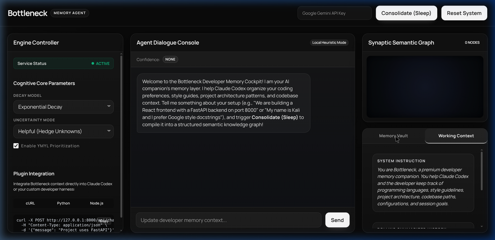
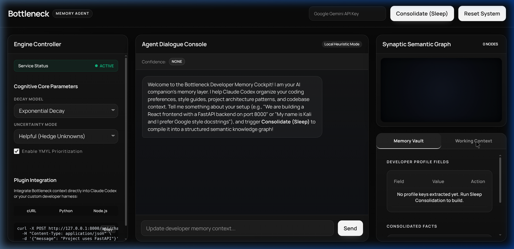

# Bottleneck — Developer Memory Agent

> **Premium cognitive memory layer for AI coding assistants.** Bottleneck helps Claude Codex, Gemini, and custom agents organize coding preferences, style guides, project architecture, and codebase environments — with a stunning real-time neural memory graph.

---

## 📸 Screenshots

### Developer Memory Cockpit



### Neural Memory Graph (Fullscreen)



---

## 🧠 The 4-Tier Developer Memory Architecture

Bottleneck manages developer context through four specialized memory tiers:

1. **Sensory Ingestion Memory** — Captures raw user/agent dialogue and filters input using **Prompt Sanitization** to protect against prompt-injection instructions.
2. **Short-Term (Working) Memory** — Manages the immediate conversation context with rolling token/turn summaries, preventing context window bloat for AI coding assistants.
3. **Long-Term Episodic Memory** — Stores historical session logs. Retrievable memories are weighted by **Recency**, **Importance**, and **Relevance**. Supports dynamic decay models and **YMYL (Your Money Your Life) Immunity** to protect sensitive API keys and critical declarations from decay.
4. **Long-Term Semantic Memory** — Structured knowledge built through sleep consolidation. Converts unstructured chat history into structured user profiles, codebase parameters, and an **Interactive Force-Directed Neural Graph** (powered by vis.js) showing real-time relationships between entities.

---

## 🔄 Core Cognitive Skills

| Skill | Description |
|---|---|
| **Prompt Sanitization** | Automatically redacts system instruction override patterns |
| **Contradiction Resolution** | Detects memory conflicts and shows resolution dialogs |
| **Decay & YMYL Immunity** | Exponential / Linear / Step decay with critical-config immunity |
| **Frustration Recovery** | Pins memories when it detects user reminder cues |
| **Plugin Integration** | Drop-in cURL / Python / Node.js snippets for Claude Codex |
| **Codebase Explorer** | Live file tree + code viewer built into the dashboard |

---

## 🚀 Quick Start

Bottleneck runs **100% offline** out-of-the-box using local heuristics. Optionally supply a Gemini API Key to enable vector embeddings and LLM-based consolidation.

### 1. Set Up & Install

```bash
python3 -m venv venv
source venv/bin/activate
pip install fastapi uvicorn pydantic pytest
```

### 2. Run the Cockpit Server

```bash
PYTHONPATH=. venv/bin/uvicorn web.server:app --reload
```

### 3. Open the Cockpit UI

Navigate to **[http://127.0.0.1:8000](http://127.0.0.1:8000)**

---

## 🎮 Dashboard Features

| Panel | What it does |
|---|---|
| **Agent Dialogue Console** | Chat with Bottleneck to feed your codebase context |
| **⬡ Neural Memory Graph** | 76-node interactive graph — drag, zoom, maximize fullscreen |
| **Memory Vault** | Browse & delete Developer Profile, Facts, Episodic logs |
| **Working Context** | View active system prompt, rolling summary, buffer messages |
| **Codebase Explorer** | Browse the whole project file tree and view any file |
| **Plugin Integration** | Copy-paste cURL / Python / Node.js integration snippets |

---

## 🔌 Integrate with Claude Codex

```bash
curl -X POST http://127.0.0.1:8000/api/chat \
  -H "Content-Type: application/json" \
  -d '{"message": "Project uses FastAPI on port 8000"}'
```

```python
import requests
res = requests.post("http://127.0.0.1:8000/api/chat",
                    json={"message": "I prefer PEP 8 and Google-style docstrings"})
print(res.json()["reply"])
```

---

## 🧪 Run Tests

```bash
PYTHONPATH=. pytest tests/
```

---

## 📁 Project Structure

```
Ai_Agent_memory/
├── bottleneck/          # Core memory modules (sensory, short_term, episodic, semantic)
│   └── skills/          # Sanitizer, YMYL classifier, decay, confidence, retrieval
├── web/
│   ├── server.py        # FastAPI backend + all API endpoints
│   └── static/          # index.html · style.css · app.js
├── tests/               # pytest unit tests
└── assets/              # Screenshots and diagrams
```

---

## 🪪 License

MIT — open-source and free to use.
